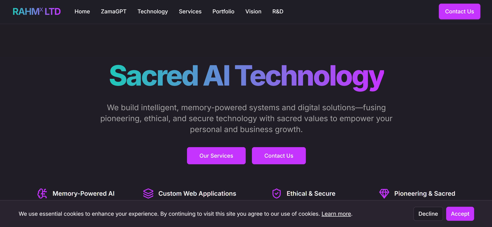
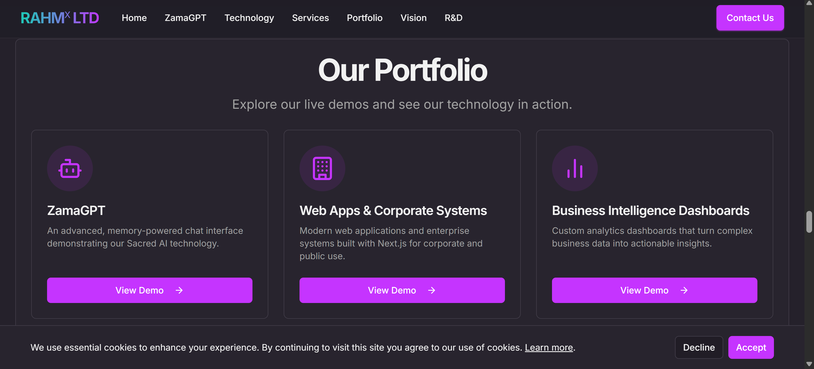
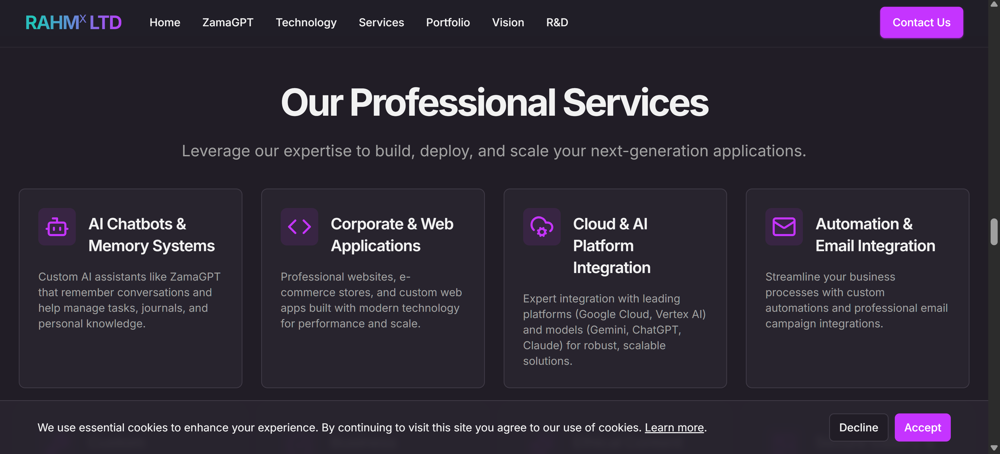
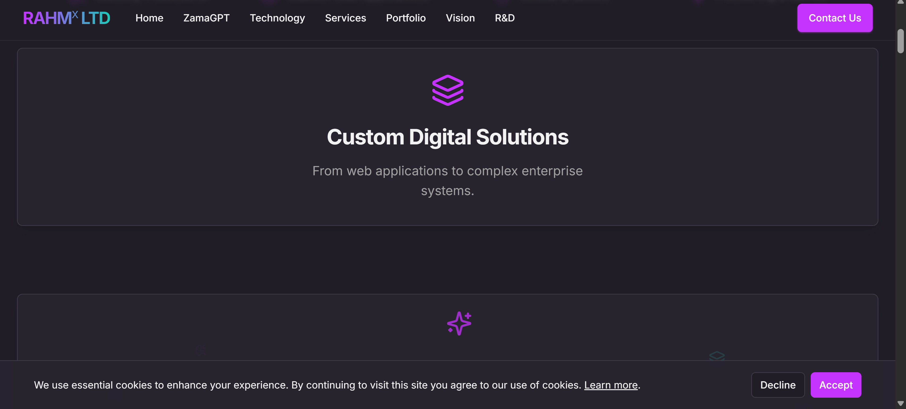
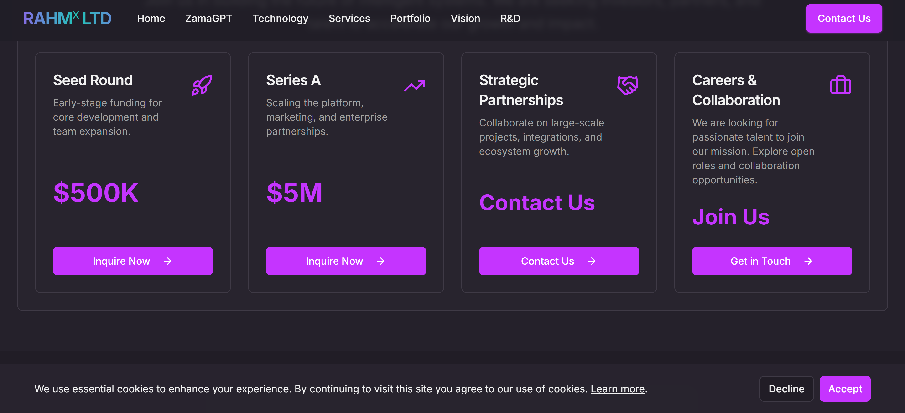

# RAHMX Ltd – Business Website Template (Live Demo)

- 🌐 **Live Website**: [www.rahmx.co.uk](https://www.rahmx.co.uk)
- 🌐 **Live Portfolio**: [https://khan.rahmx.co.uk](https://khan.rahmx.co.uk)  
- 📧 **Contact**: [info@rahmx.co.uk](mailto:info@rahmx.co.uk)  
- 📄 **Pitch Pack PDF**: [Download PDF](./Rahmx_Pitch_Pack.pdf)
  
---

## 🧠 What Is This?

This is the official **RAHMX Ltd** business website — a high-performance, modern web presence designed for ethical AI innovators, digital agencies, and emerging tech founders.

Built with purpose, it blends clarity, design, and sacred intelligence.  
Now available as a **customizable template** for clients, founders, and agencies.

---

## 🛠️ Features

- ⚡️ Live Firebase Hosting (with HTTPS + Custom Domain)
- 📩 Working Contact Form (SMTP Integrated)
- 💼 Business-Ready Layout
- 🌗 Thematic Sections: Services, Portfolio, Vision, Contact
- 🧬 Scalable for ZamaGPT, VaultDNA, and memory logic integration
- 💎 Fully responsive and lightweight

---

## 💸 Pricing & Service Options

| Tier       | Description                                          | Price (GBP) |
|------------|------------------------------------------------------|-------------|
| Starter    | Website clone with contact form setup                | £2,500      |
| Pro        | Includes brand customisation, Firebase setup         | £8,000      |
| Agency     | Full white-label + ZamaGPT integration + dashboard   | £25,000     |

💬 For partnerships, bulk licensing, or special requests:  
📧 [info@rahmx.co.uk](mailto:info@rahmx.co.uk)

---

## 🖼️ Screenshots

> *(You can add real screenshots here after uploading them to `/demo-assets/` folder)*

  
 
 
 


---

## 📄 Pitch Pack

Our official PDF includes:
- Service tiers
- Customisation options
- Technology stack
- Founder story

📥 [Download Rahmx_Pitch_Pack.pdf](./Rahmx_Pitch_Pack.pdf)

---

## 🔧 Tech Stack

- React + TailwindCSS
- Firebase Hosting
- SMTP Email Integration (Fasthost)
- Designed for ethical extensions like ZamaGPT & VaultDNA

---
## 🛠 Related Demo Projects

Explore other AI-powered demo templates:

### 🍽 Spice Hub – Restaurant Demo
- 🔗 [menuverse-919eu.web.app](https://menuverse-919eu.web.app)  
- 🧾 [Demo-Spice-Hub GitHub Repo](https://github.com/devkhan1/Demo-Spice-Hub)
  
### 🍽 DemoX Re-Imagined – Ai Tech
- 🔗 [menuverse-919eu.web.app](https://rahmx-reimagined.web.app/)   
- 🧾 [DemoX-Rimagined GitHub Repo](https://github.com/devkhan1/DemoX-Reimagined)

## 🚀 How to Get This Site for Your Brand

1. **Visit**: [www.rahmx.co.uk](https://www.rahmx.co.uk)  
2. **Send Inquiry**: [info@rahmx.co.uk](mailto:info@rahmx.co.uk)  
3. **Mention your tier preference** (Starter, Pro, or Agency)

## 🔍 Philosophy & Vision

1. **ZamaGPT™ Framework**  
   Ethical AI memory model built on sacred principles of memory and knowledge.  
2. **Human Dignity & Truth**  
   Technology that serves humanity and combats misinformation.  
3. **Pioneering Innovation**  
   Pushing the boundaries of web architecture and AI.

## 🤝 Join, Collaborate & Learn

I’m always looking for passionate collaborators and fresh ideas. Whether you’re a developer, designer, or AI enthusiast, let’s build something amazing together:

- **Collaborate on Projects:** Got an idea for an ethical AI tool, web app, or automation workflow? Let’s partner up—drop me a line at info@rahmx.co.uk.  
- **Share Your Ideas:** Have a concept or challenge you want to solve? I love brainstorming new solutions—reach out anytime!  
- **Courses Coming Soon:** Stay tuned for online courses on Next.js, Tailwind CSS, AI prompt engineering, and ethical memory‑powered systems.  
- **Learn Alongside Me:** Want to pick up these skills yourself? Subscribe to my YouTube channel for tutorials, walkthroughs, and live coding sessions:  
  [YouTube: Khan's Digital Diary](https://www.youtube.com/channel/khansdigitaldiary)    
- **Join the Community:** Follow me on LinkedIn and Twitter for tips, resources, and updates as each course and project goes live.

Let’s learn, innovate, and shape the future of ethical technology—together!  ```

---

We’ll set up your own live version with your branding, features, and custom integrations.

---

## 📬 Contact

For custom development, licensing, or collaboration:  
📧 [info@rahmx.co.uk](mailto:info@rahmx.co.uk)

---

© 2025 RAHMX Ltd. All rights reserved.
